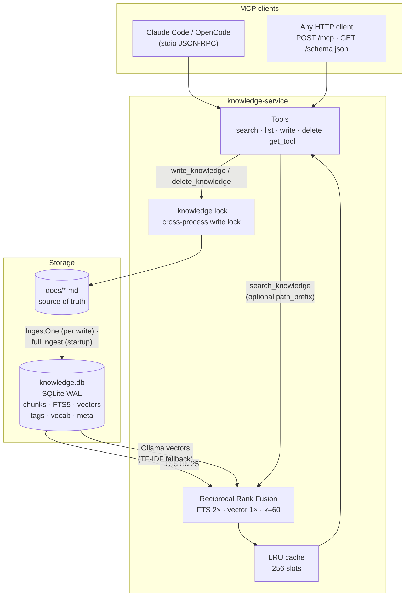

# knowledge-service

A lightweight MCP server that gives AI assistants a persistent, searchable knowledge base backed by **plain markdown files**.

Write runbooks, solutions, and one-liners into it from conversations — they land as `.md` files in `docs/` that you can read, edit, and `git diff`. The SQLite DB is a derived search index rebuilt automatically on every startup.

## What it does

- **Markdown-first**: every `write_knowledge` call writes a `.md` file to `docs/` and re-indexes it. Edit files by hand; they're picked up on the next restart
- **Startup sync**: on launch the server scans `docs/` and rebuilds the DB — the index is always consistent with what's on disk
- **Hybrid search**: BM25 FTS5 (keyword) + Ollama semantic vectors merged via Reciprocal Rank Fusion
- **5 MCP tools** over stdio (Claude Code, OpenCode) or HTTP (curl, any OpenAI-compatible client)
- **Self-improving**: after every session the agent writes what it learned back into `docs/`, so future sessions search it before answering

## Quick Start

**Prerequisites**: Go 1.24+, Make

For semantic search (recommended): [Ollama](https://ollama.com) with `nomic-embed-text`. Without it the server falls back to TF-IDF keyword search silently — everything works, just with weaker paraphrase matching.

```bash
# Build both binaries
make build

# Install to ~/.local/bin
make install

# (Optional but recommended) pull the embedding model
ollama pull nomic-embed-text

# Wire into your MCP client (see below)
# On first start the server auto-ingests docs/ — no manual step needed
```

## Wiring into Claude Code

```bash
claude mcp add knowledge /path/to/knowledge-service \
  -e DB_PATH=/path/to/knowledge.db \
  -e DOCS_PATH=/path/to/docs \
  -e EMBED_PROVIDER=ollama \
  -e EMBED_MODEL=nomic-embed-text \
  -e LOG_LEVEL=warn \
  --scope user
```

The `search_knowledge`, `list_knowledge`, `write_knowledge`, `delete_knowledge`, and `get_tool` tools are then available in every Claude Code session.

## Wiring into OpenCode

Copy `opencode.json` to your workspace root (it's already in this repo — adjust the `command` path if needed) and restart OpenCode.

## Tools

| Tool | When to call | Notes |
|---|---|---|
| `search_knowledge` | Before answering any question where prior knowledge might exist | Optional `path_prefix` scopes results (e.g. `runbooks/`) |
| `list_knowledge` | Before writing (check for duplicates) or deleting (find exact path) | Supports path-prefix filter; shows tags |
| `write_knowledge` | After solving a non-trivial problem or discovering something non-obvious | Use `tools/<name>.md` for scripts; other paths for docs |
| `delete_knowledge` | When a runbook is dangerously wrong or fully superseded | **Permanent** — prefer updating with `write_knowledge` |
| `get_tool` | To retrieve a stored script or one-liner by name | Exact match on `tools/<name>.md` first (`"drain node"` → `tools/drain-node.md`), fuzzy search over `tools/` as fallback |

## Architecture



**Storage**: Plain markdown files in `docs/` (source of truth) + SQLite WAL mode as a derived search index. Single portable `.db` file, rebuilt from `docs/` whenever needed.

**Embedding (active)**: Ollama `nomic-embed-text` — 768-dim dense semantic vectors. Catches paraphrases and intent that keyword search misses. Requires `ollama pull nomic-embed-text` and `EMBED_PROVIDER=ollama`.

**Embedding (fallback)**: TF-IDF with feature hashing — 1024-dim, offline, zero deps. Heading-boost (3×) and SRE synonym expansion (`OOMKilled ↔ oom`, `CrashLoopBackOff ↔ crashloop`, etc.).

See [docs/architecture.md](docs/architecture.md) for diagrams, embedding details, and known limitations.

## Document Format

Markdown files in `docs/` are split at `#`, `##`, and `###` headings (subsections are indexed as "Parent / Child"). Headings inside fenced code blocks are never treated as headings. Each heading + its body becomes one searchable chunk. Mermaid diagrams, code blocks, and tables inside sections are included as-is and indexed as text content.

Optional YAML frontmatter is stripped before indexing; a `tags: a, b, c` entry is stored as document metadata (shown by `list_knowledge`, appended to the search index so tag terms are searchable). Chunks record an `updated_at` timestamp shown in search results.

### Path conventions

| Path prefix | Content type | Retrieved via |
|---|---|---|
| `runbooks/<service>-<symptom>.md` | Incident runbooks | `search_knowledge` |
| `solutions/<topic>.md` | One-time fixes with context | `search_knowledge` |
| `tools/<name>.md` | Executable scripts, one-liners | `get_tool("<name>")` |
| `guides/<topic>.md` | How-to guides | `search_knowledge` |
| `architecture/<component>.md` | Architecture notes | `search_knowledge` |

`tools/` entries must contain a fenced code block. `get_tool` extracts and returns the first one as raw executable code.

### Write-back template (for agents)

The `heading` argument becomes the `##` section; everything inside `content` should use `###` subsections (any `##` you pass is demoted automatically, and re-writing a heading replaces its whole section including old subsections):

```markdown
heading: "OOMKilled on argocd-server"
content:
### Symptom
[What the alert or user saw]

### Root Cause
[Why it happened]

### Fix
```bash
# Exact commands
```

### Prevention
[How to stop it from happening again]
```

## Environment Variables

| Variable | Default | Description |
|---|---|---|
| `DB_PATH` | `knowledge.db` | Path to the SQLite search index |
| `DOCS_PATH` | _(required)_ | Absolute path to the markdown source-of-truth directory. There is no default and no DB-only mode — a relative default would silently resolve against whatever directory each client session starts in. Created if missing. |
| `LOG_LEVEL` | `info` | `debug` / `info` / `warn` / `error` |
| `EMBED_PROVIDER` | _(unset = TF-IDF)_ | Set to `ollama` for semantic embeddings. If Ollama is unreachable at startup the server falls back to TF-IDF **without overwriting** stored provider vectors — search degrades, the index never does. |
| `EMBED_URL` | `http://localhost:11434` | Ollama base URL |
| `EMBED_MODEL` | `nomic-embed-text` | Ollama model name |
| `EMBED_DIMS` | `1024` | TF-IDF vector dimension (only when provider is TF-IDF) |
| `AUTH_TOKEN` | _(unset = no auth)_ | Bearer token for HTTP mode |

## Smoke Test (stdio mode)

Verify the server is healthy without an MCP client:

```bash
echo '{"jsonrpc":"2.0","method":"ping","id":1}' | knowledge-service
# → {"jsonrpc":"2.0","id":1,"result":{}}
```

## HTTP Mode (non-MCP clients)

```bash
knowledge-service --http :3737
```

Exposes:
- `POST /mcp` — JSON-RPC 2.0, same as stdio
- `GET /schema.json` — OpenAI function-calling schema (for GPT-4o, Gemini, Ollama)
- `GET /health` — readiness probe (includes DB ping; returns 503 if DB is unavailable)

> **Note**: Set `AUTH_TOKEN` to require `Authorization: Bearer <token>` on all requests (the `/health` endpoint is always exempt).

## Docker

```bash
docker compose up -d
```

`docker-compose.yml` starts knowledge-service (port 3737) + Ollama. The `./docs` directory is mounted read-write so `write_knowledge` can persist new entries to disk. On first run, pull the embedding model:

```bash
docker compose exec ollama ollama pull nomic-embed-text
```

## Building

```bash
make build      # builds bin/knowledge-service and bin/knowledge
make ingest     # force full re-ingest of docs/ (normally done automatically on startup)
make tidy       # go mod tidy
make clean      # removes bin/ and knowledge.db
```

> **`make ingest` and live servers**: If you change `EMBED_PROVIDER` or `EMBED_MODEL`, stop the server first, then run `make ingest` to re-vectorize the corpus with the new provider, then restart. Running `make ingest` against a live server targeting the same `DB_PATH` may hit SQLite write conflicts.

The binary is ~14 MB, statically linked, no CGo required.

## Testing

```bash
go test -race ./...
```

64 tests across chunker, embed, store, cache, and mcp packages.

## Known Limitations

- **Linear vector scan**: all chunk vectors are loaded into RAM and scanned per query. Fine under ~5,000 chunks; an ANN index would be needed beyond that.
- **Tag search, not tag filter**: tags are indexed as searchable text and shown in listings, but `search_knowledge` cannot filter *by* tag — use `path_prefix` for scoping.
- **Paraphrases in TF-IDF mode**: `"disk full"` and `"no space left on device"` won't match each other without Ollama. Use `EMBED_PROVIDER=ollama` (recommended) or write runbooks with both forms.
- **Mermaid in write_knowledge content**: Mermaid diagram source is stored and indexed as text. The chunker does not render it — it's useful for visual review in the `.md` files but the search indexes raw mermaid syntax.
- **Multi-process writes**: concurrent knowledge-service processes (several Claude Code sessions) serialise via a lock file in `DOCS_PATH` (`.knowledge.lock`); a write waits up to 10s for the lock, and stale locks from crashed processes are stolen after 30s.

## Contributing

See [CONTRIBUTING.md](CONTRIBUTING.md) for setup, dev workflow, and how to add a new embedding provider.

## License

[LICENSE](LICENSE)
