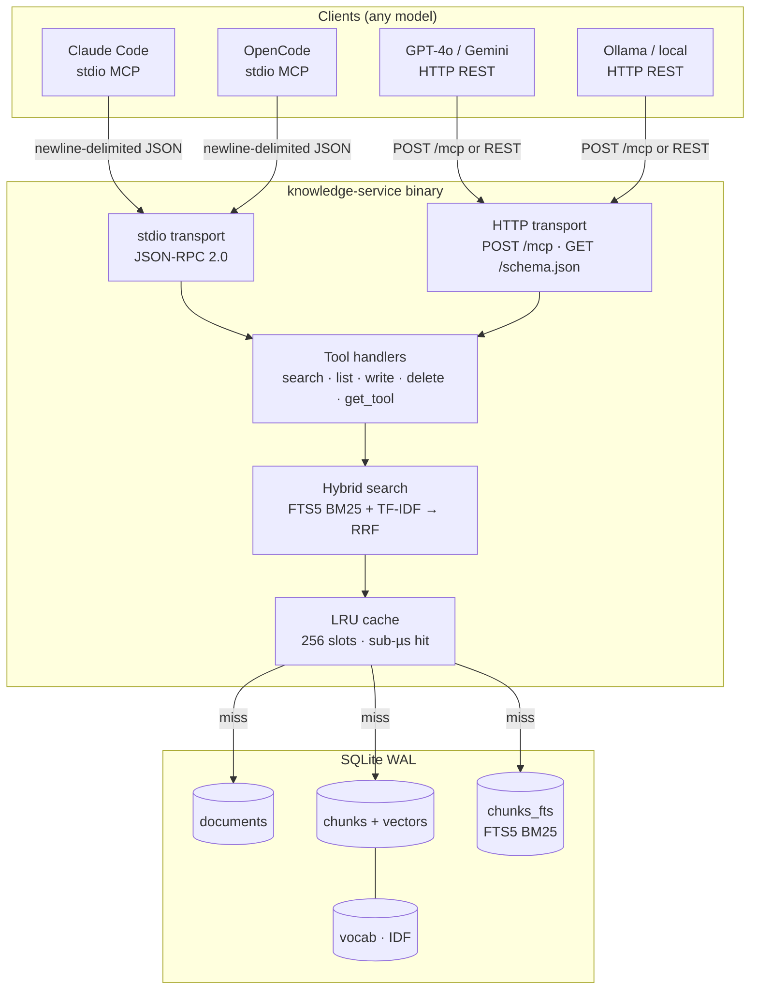
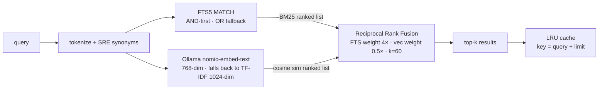
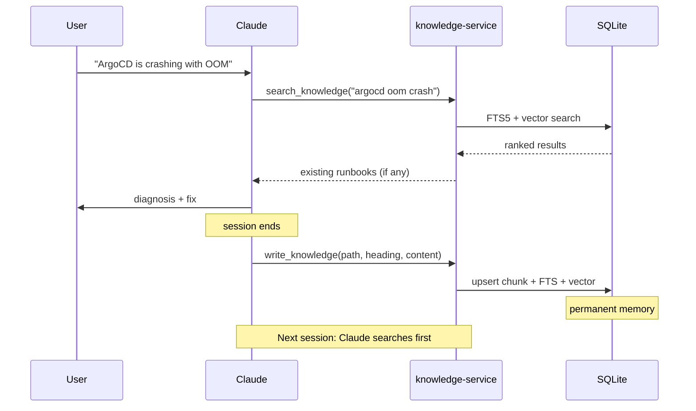

# Architecture

## System Overview



## Retrieval Pipeline



## Self-Improvement Loop



## Knowledge Layout Convention

```
knowledge.db  ←  single SQLite file, portable
docs/         ←  source markdown (batch-ingested)
  getting-started.md
  architecture.md     ← this file
  tools-guide.md

Written at runtime via write_knowledge:
  runbooks/<service>-<symptom>.md   ← incident runbooks
  solutions/<topic>.md              ← one-time fixes
  tools/<name>.md                   ← executable scripts / one-liners
  guides/<topic>.md                 ← how-tos
  architecture/<component>.md       ← architecture notes
```

## Transport Modes

| Mode | Flag | Used by |
|---|---|---|
| stdio MCP | _(default)_ | Claude Code, OpenCode |
| HTTP MCP | `--http :3737` | Any HTTP client, Cursor, web tools |

The HTTP mode exposes `POST /mcp` (same JSON-RPC) and `GET /schema.json` (OpenAI function-calling format) so any model can call the same tools without needing native MCP support.

## Embedding

Two embedding modes are supported; switch via the `EMBED_PROVIDER` env var.

### TF-IDF (default, no dependencies)

```
Tokenize + SRE synonym expansion
  → TermFreq (heading tokens weighted 3×)
  → IDF lookup (vocab table, rebuilt after every write)
  → FNV-32a hashing trick → 1024-dim float32
  → L2 normalize
```

- Dimensions: 1024 (was 512; halves collision rate)
- IDF: `log((N+1)/(df+1)) + 1` (sklearn smooth), recomputed over **all chunks** after every `write_knowledge` call and every `ingest` run — no staleness
- Heading tokens repeated 3× before computing TF so headings carry proportionally more weight
- SRE synonym pairs hard-wired in `Tokenize`: `OOMKilled ↔ oom`, `CrashLoopBackOff ↔ crashloop`, `evict ↔ eviction`, `drain ↔ evict`, `timeout ↔ deadline`, `imagePullBackOff ↔ imagepull`, `notReady ↔ unreachable`

### Ollama (optional, semantic)

Set `EMBED_PROVIDER=ollama` to call a local Ollama instance instead of TF-IDF.
Recommended model: `nomic-embed-text` (768-dim, runs on CPU, excellent quality).

```
EMBED_PROVIDER=ollama
EMBED_URL=http://localhost:11434    # default
EMBED_MODEL=nomic-embed-text        # default
```

After switching providers, run `make ingest` to re-vectorize all existing chunks.

**Search quality comparison**:

| Scenario | TF-IDF | Ollama |
|---|---|---|
| Exact term (`OOMKilled`) | ✓ excellent (FTS5 BM25) | ✓ excellent |
| Partial prefix (`kube*`) | ✓ good | ✓ good |
| SRE synonyms (`oom` / `OOMKilled`) | ✓ via expansion map | ✓ semantic |
| General paraphrases | ✗ | ✓ |
| Semantic intent (`slow` ↔ `high latency`) | ✗ | ~ partial |

## Known Limitations

| Limitation | Status |
|---|---|
| Linear vector scan O(n) | Fine to ~5,000 chunks; LRU caches repeated queries |
| No metadata/tag filtering | Use `list_knowledge("runbooks/")` to scope, then search |
| HTTP endpoint unauthenticated | Set `AUTH_TOKEN` env var to enable Bearer auth |
| Switching embedding providers requires re-ingest | Run `make ingest` after changing `EMBED_PROVIDER` |
| General paraphrases without Ollama | Use Ollama mode or write runbooks with multiple term forms |
